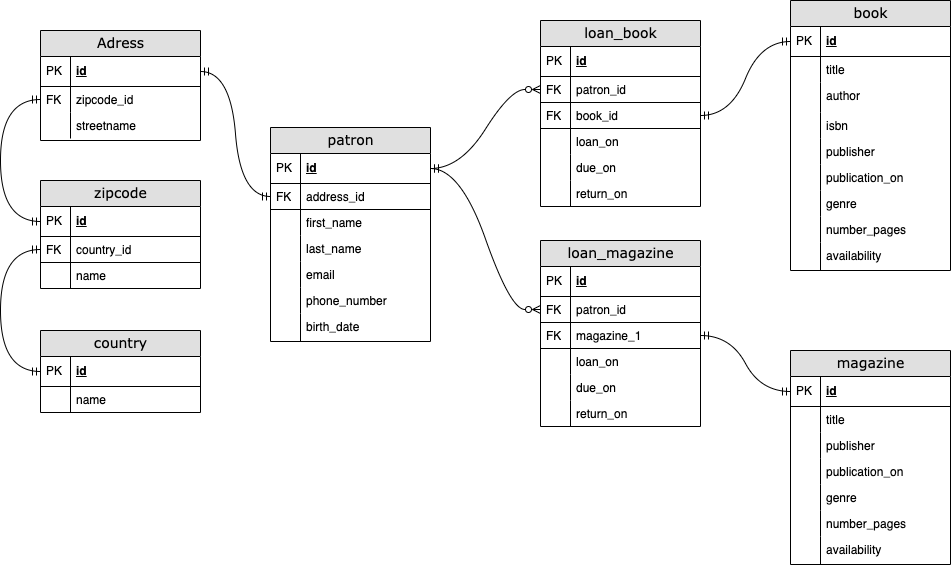

## Setup
### Starting server
```console
docker-compose -f docker-compose.yml up -d
```
After starting the server, you should run the seed.sql script to generate dummy data.
### Stored Procedures
The stored procedures should be in the database. If you would like to see them then head to the **procedures** folder.

## Entity Relational Diagram



### Denormalization & Normalization

It is important to normalize the design of the database. Therefore achieving a higher normalization level is better. But sometimes you do not want to normalize some aspect of the design, because it will hurt performance in the long run.

Our database design fulfills the 3.5 Normalization level. But it is not efficient when it comes to querying all the loans a patron can have. In our design we would have to join tables to acquire the result. This approach can hurt the database if data is large. Since our data is not large we can accept the performance hit, but with a better normalization.

## Explanation of the CAP theory and ACID properties, and how they were applied to the database design and implementation

The CAP (Consistency, Availability, and Partition tolerance) theory is a concept in distributed systems that suggests that it is impossible for a distributed database system to simultaneously provide all three guarantees of consistency, availability, and partition tolerance.

Consistency refers to ensuring that all nodes in a distributed system have the same data at the same time. Availability refers to the ability of the system to respond to client requests. Partition tolerance refers to the system's ability to continue functioning even if there are network failures or partitions.

According to the CAP theory, a distributed system can only provide two out of the three guarantees at a time. For example, a system can provide consistency and availability, but not partition tolerance. Alternatively, a system can provide partition tolerance and availability, but not consistency.

The ACID properties, on the other hand, are a set of properties that ensure reliable processing of database transactions. ACID stands for Atomicity, Consistency, Isolation, and Durability. Atomicity ensures that a transaction is treated as a single, indivisible unit of work. Consistency ensures that the database is always in a valid state. Isolation ensures that concurrent transactions do not interfere with each other. Durability ensures that once a transaction is committed, it is permanently stored and cannot be lost.

One of the ways we have used ACID is shown in the creation of stored procedures, where we use transactions to treat one or multiple operations as a single operation. If one of these operations in a transaction fails, we rollback all the changes that were made up to the failure. This ensures that the database is consistent and relaible.

## Reflections on the challenges faced and lessons learned during the implementation of the database.

Learning how to write in SQL language and implement ACID properties for the first time can be a bit of a challenge, but it's definitely worth it. It has its own syntax and structure, so it takes some time to learn and understand.

Implementing ACID properties is important to ensure the reliability and consistency of database transactions. It can be a complex task that requires a good understanding of the underlying database architecture, and the ability to write efficient, error-free code.

Overall, learning SQL and ACID properties is a valuable investment us in the field of database management and development. Although it may take some time and effort, the benefits are well worth it in the long run.

## Conclusion and recommendations for future improvements.

In conclusion, ACID properties are essential for ensuring the reliability and consistency of database transactions. These properties provide a solid foundation for building robust and secure database systems that are crucial for powering transaction-critical applications.

In addition to ACID, another important consideration when building a database is indexing. Indexing is the process of creating special data structures that allow for fast retrieval of data based on certain criteria. By indexing the database, you can significantly improve the speed and performance of queries, making it easier to retrieve the information you need quickly.

By doing so, you can ensure that your database is optimized for performance and capable of handling complex transactions with ease.
